# S4 Bucket – S3-like API backed by FTP

## Overview

S4 Bucket (scams3 or the scam secure storage service) is a Node.js API that mimics AWS S3, but stores files and folders on a remote FTP server. It is designed for cheap, legacy, or shared hosting environments (like Mochahost, Hostigator, GoDaddy, etc.) where only FTP is available. The API supports buckets, files, folders, and full JWT authentication, and is production-tested on IIS/iisnode.

## Architecture



The system architecture shows how the Node.js API acts as a bridge between HTTP clients and FTP storage, with JWT authentication and database persistence for metadata.

---

## Features

- S3-like REST API for buckets, files, and folders
- Physical file/folder management via FTP (using superuser credentials)
- JWT authentication for all endpoints
- Works on shared IIS hosting (Mochahost) and local development
- Robust error handling and environment-aware configuration
- Full integration and deployment documentation
- Automated deployment script for Mochahost

---

## API Documentation

Interactive OpenAPI/Swagger documentation is available at:

- **Local development**: `http://localhost:3000/api-docs`
- **Production**: `https://api.s4.506software.com/api-docs`

The Swagger UI provides:
- Interactive API testing for all endpoints
- JWT Bearer token authentication support
- Complete request/response schemas with examples
- Organized by tags (Authentication, Buckets, Files, Folders, Health, Users)
- Error handling documentation for all endpoints

---

## Project Structure

```
scams3/
├── src/                # All TypeScript source code
│   ├── app.ts          # Main Express app (no listen)
│   ├── server.ts       # Starts the server (production only)
│   ├── api/            # Routers (auth, buckets, files, folders)
│   ├── middlewares/    # Auth, error handling, etc
│   ├── models/         # Sequelize models
│   ├── services/       # FTP service
│   └── ...
├── dist/               # Compiled JS (never edit)
├── package.json
├── tsconfig.json
├── web.config          # IIS/iisnode config
├── .env                # Environment variables (never in dist/)
├── env.example         # Example .env file
├── api.http            # Local API test requests
├── api.prod.http       # Production API test requests
├── docs/               # Deployment and architecture docs
└── ...
```

---

## Quickstart

1. **Clone and install:**
   ```bash
   git clone <repo-url>
   cd scams3
   npm install
   ```

2. **Copy and configure `.env`:**
   ```bash
   cp env.example .env
   # Edit .env with your DB, FTP, and JWT credentials
   ```

3. **Develop and run locally:**
   ```bash
   npm run dev
   # or
   npm run dev:watch
   ```

4. **Build for production:**
   ```bash
   npm run build
   ```

5. **Deploy to Mochahost:**
   ```bash
   npm run deploy:mochahost
   # On the server (Plesk):
   npm install --production
   npm run build
   ```

---

## Environment Variables

See `env.example` for all required variables.  
**Key variables:**
- FTP: `SUDO_FTP_HOST`, `SUDO_FTP_USER`, `SUDO_FTP_PASS`, etc.
- DB: `DB_HOST`, `DB_USER`, `DB_PASSWORD`, `DB_NAME`, `DB_PORT`
- JWT: `JWT_SECRET`, `JWT_EXPIRES_IN`
- `NODE_ENV`, `PORT`

**Always keep `.env` in the project root (never in `dist/`).**

---

## Environment Variable Loading

- The app always loads `.env` from the project root:
  ```ts
  import dotenv from 'dotenv';
  import path from 'path';
  dotenv.config({ path: path.resolve(__dirname, '../.env') });
  ```
- This works for both local dev and production (when running from `dist/`).

---

## IIS/iisnode Deployment (Mochahost)

- Place `web.config` in the project root.
- Main entry point should be `dist/app.js` or `dist/index.js`.
- `.env` must be in the project root, not in `dist/`.
- See `docs/MOCHAHOST-DEPLOYMENT.md` and `docs/MOCHAHOST-QUICKSTART.md` for full details, troubleshooting, and best practices.

---

## API Endpoints

See `api.http` (local) and `api.prod.http` (production) for ready-to-use requests.

**Buckets**
- `GET /buckets` – List buckets
- `POST /buckets` – Create bucket
- `DELETE /buckets/:id` – Delete bucket and all its files

**Files**
- `GET /files` – List files
- `POST /files` – Upload file (multipart/form-data)
- `GET /files/:id/download` – Download file
- `DELETE /files/:id` – Delete file

**Folders**
- `GET /folders` – List folders
- `POST /folders` – Create folder
- `DELETE /folders` – Delete all files in a folder

**Auth**
- `POST /auth/login` – Get JWT
- All protected endpoints require `Authorization: Bearer <token>`

---

## Testing

- Run all tests: `npm test`
- See `tests/services.ftp.test.ts` for integration tests (FTP, buckets, files).
- Increase Jest timeout for slow FTP/DB operations.

---

## Best Practices

- **Single Sequelize instance:** Only initialize Sequelize once and pass the `db` object to all routers and scripts.
- **Never throw at top level:** Always return JSON errors from endpoints.
- **Remove debug output before production.**
- **Never commit `.env` to version control.**
- **Use strong, unique secrets for DB and JWT.**

---

## Troubleshooting

- **500 errors on IIS:** Check `.env` path, main entry in `web.config`, and that you are running compiled JS from `dist/`.
- **Environment variables not loading:** Ensure `.env` is in the project root and path logic matches your entry point.
- **See `docs/MOCHAHOST-DEPLOYMENT.md` for more.**

---

## Contributing

- Use feature branches and PRs (see example in README).
- Follow Node.js and TypeScript conventions.
- All new endpoints must be covered by integration tests.

---

## License

MIT

---

If you need more details or want to add a section, let me know!